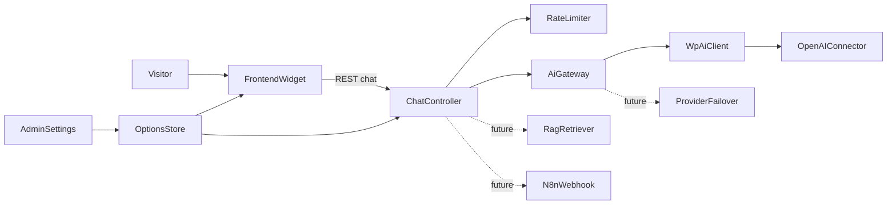

# ChatHearth - AI Chatbot Plugin Implementation Plan

## Decisions locked in

| Topic            | v1 choice                                           | Future                                                         |
| ---------------- | --------------------------------------------------- | -------------------------------------------------------------- |
| AI replies       | Non-streaming; typing indicator then full reply     | Real token streaming                                           |
| Placement        | Site-wide floating widget                           | Hide controls; shortcode; Gutenberg; Elementor; other builders |
| History          | `localStorage` in the browser                       | Server-side history (TBD later)                                |
| Provider/model   | OpenAI only; fixed default model in code            | Main + backup provider; later DeepSeek/OpenRouter/etc.         |
| Welcome UX       | Greeting text + clickable starter phrases           | (extend as needed)                                             |
| Launcher icon    | One default icon + style controls                   | Custom image/SVG upload                                        |
| Abuse protection | Nonce + per-IP/global limits + escalation + kill switch + **optional reCAPTCHA v2** (when keys set) | Turnstile / hCaptcha / reCAPTCHA v3; token/cost ceilings |
| Local vector DB  | Deferred                                            | Choose at first RAG release; only interfaces in v1             |

## Environment & prerequisites

- **WordPress:** 7.0+ (Connectors + AI Client present in this install: 7.0.1).
- **Required:** [AI Provider for OpenAI](wp-content/plugins/ai-provider-for-openai) active; API key set under **Connectors** (`connectors_ai_openai_api_key`).
- **Integration API:** `wp_ai_client_prompt()` → `using_provider( 'openai' )` → `using_system_instruction()` → `with_history()` → `generate_text_result()` (no streaming in core today).
- **Plugin folder:** [wp-content/plugins/chathearth](wp-content/plugins/chathearth) (planning docs only today).

## Early architecture (prep for future)

Implement modular PHP from day one so later features plug in without rewriting the chat path:



- **`AiGateway`:** single entry for “generate reply”; v1 implementation calls WordPress AI Client / OpenAI only. Future: main/backup providers, third-party providers, optional N8N replacement of AI and/or RAG.
- **`ChatPipeline` hooks/filters** (e.g. `chathearth_before_generate`, `chathearth_system_prompt`, `chathearth_messages`): reserved for RAG context injection and N8N routing later—no RAG/N8N code in v1.
- **No custom conversation tables in v1** (per decision); document schema ideas in `plan/` for a future history release.
- **Vector store:** do not pick SQLite/Chroma yet; define a thin `VectorStoreInterface` stub folder or doc-only contract under `plan/architecture.md` so RAG work has a clear extension point.
- **Autoload + namespaces** (`ChatHearth\…`) and clear `includes/` layout so `Admin`, `Frontend`, `Rest`, `Ai`, `Security` stay separated.

## Proposed plugin structure (v1)

```
chathearth/
  chathearth.php              # bootstrap, constants, activation
  uninstall.php                # clean options on delete (optional keep settings)
  readme.txt                   # WP.org-style header for plugin details
  README.md                    # developer/user docs (create & refine — plan step)
  plan/
    functionalities.md         # keep in sync with shipped + roadmap
    architecture.md            # extension points (RAG, N8N, providers)
  includes/
    class-plugin.php
    Admin/class-settings-page.php
    Frontend/class-assets.php
    Rest/class-chat-controller.php
    Ai/class-ai-gateway.php
    Security/class-rate-limiter.php
  assets/
    css/admin.css, frontend.css
    js/admin.js, frontend.js
    images/launcher-default.svg
  languages/                   # text domain ready
```

## v1 implementation steps

### 1. Bootstrap & dependency checks

- Main file with plugin header (`Plugin Name: ChatHearth - AI Chatbot`, text domain `chathearth`).
- On `plugins_loaded` / admin notices: require `wp_supports_ai()`, OpenAI connector/provider available; clear admin notice with link to Connectors if missing/inactive or key unset.
- Fixed default model constant (e.g. `gpt-4.1` or latest metadata-safe default from provider docs)—not exposed in settings in v1.
- Default options on activation (welcome text, starters, system prompt, styles, rate limits, `chat_enabled`).

### 2. Settings page (wp-admin)

Single top-level or Settings submenu page using Settings API / options group `chathearth_settings`:

- **Appearance:** icon shape (circle/square), border color, background color, icon color, size, corner position (e.g. bottom-right/left), popup width/height or size preset, header title, message bubble colors (useful UX extras).
- **Welcome:** greeting message (textarea) + starter phrases (one per line or repeater).
- **AI:** system prompt (textarea only in v1; no provider/model UI).
- **Protection:** enable/disable chatbot (kill switch); max requests per minute / per hour (per IP and site-wide/global); escalate after N global-limit hits (email + admin notice); optional auto-disable on escalation; max message length.
- Link/help text: “Configure OpenAI API key under Connectors” (do not duplicate key storage).

Live preview of launcher colors on the settings page is a nice-to-have; keep minimal if it slows v1.

### 3. REST chat endpoint

- Route e.g. `POST /wp-json/chathearth/v1/chat`.
- Body: `{ message, history[] }` (client sends recent turns from `localStorage`).
- Checks: chatbot enabled, nonce (or REST nonce for guests), **global then per-IP** rate limits, sanitize/truncate input, max history length sent to model.
- Call `AiGateway` → `wp_ai_client_prompt( $message )->using_provider( 'openai' )->using_model_preference( DEFAULT )->using_system_instruction( $prompt )->with_history( ... )->generate_text_result()`.
- Return `{ reply }` or `WP_Error` JSON; never expose API keys or raw provider secrets.

### 4. Frontend widget

- Enqueue CSS/JS on `wp_enqueue_scripts` for all public pages (respect kill switch: skip enqueue if disabled).
- Floating launcher (default SVG) → opens popup.
- On open: show greeting + starter chips; chips send that text as the user message.
- Persist thread in `localStorage` (key namespaced); restore on load; “Clear chat” control optional but recommended.
- Send message → show user bubble + typing indicator → await REST → append full assistant reply.
- Pass localized config: REST URL, nonce, styles, welcome, starters (no secrets).

### 5. Security & limits

- Guest-accessible REST with nonce from `wp_create_nonce`.
- Rate limiter: global site caps then per-IP caps; object-cache `incr` or locked transients; kill switch stops enqueue + rejects REST.
- Global-limit incident counter → admin email (cooldown), dismissible notice, optional auto-disable of `chat_enabled`.
- Capability: settings page `manage_options` only.

### 6. README.md (create & refine)

Dedicated step after core works:

- What the plugin does (v1 vs roadmap).
- Requirements (WP 7+, AI Provider for OpenAI, Connectors key).
- Install/activate steps.
- Settings overview and Connectors setup.
- How chat works (non-streaming note; `localStorage` history).
- Developer notes: filters/hooks, folder layout, extension points for RAG/N8N/providers.
- Also add/sync `readme.txt` Stable Tag / description for WordPress admin plugin card.
- Keep [plan/functionalities.md](wp-content/plugins/chathearth/plan/functionalities.md) aligned with decisions above.

### 7. Manual test checklist

- Activate with/without OpenAI provider; admin notices.
- Settings save/load; kill switch hides widget and blocks API.
- Per-IP and global rate limits trigger after configured thresholds; repeated global hits escalate (email/notice/auto-disable).
- Site-wide launcher; welcome + starters; `localStorage` survives refresh.
- Multi-turn context reaches the model; errors show friendly UI message.

## Future releases (roadmap in plan + README)

Ordered roughly for later work (not built in v1):

1. **Visibility & embeds:** hide/placement controls (spec later); shortcode; Gutenberg block; Elementor widget; more page builders.
2. **Streaming:** real SSE/token stream when AI Client supports it, or dedicated streaming path using Connectors-stored key.
3. **Providers:** settings for main + backup AI provider; then third-party (DeepSeek, OpenRouter, …).
4. **Launcher:** custom image/SVG upload.
5. **Conversation history:** server-side storage/management (design deferred).
6. **RAG:** enable flag; document CRUD + versioning; site content → MD by selected post types; local store chosen then; remote stores (Pinecone, Supabase, …) incremental.
7. **N8N webhook:** optional path for custom RAG/agents; may replace Connectors AI and/or built-in RAG.
8. **More CAPTCHA providers:** Cloudflare Turnstile, hCaptcha, and Google reCAPTCHA **v3** (v2 already optional when keys are set).
9. **Token/cost ceilings:** usage monitoring and hard budgets with escalation (beyond request-count protection).

v1 only reserves `AiGateway` + filter hooks + architecture notes—no RAG/N8N UI or tables.

## Out of scope for first implementation PR(s)

- Streaming, multi-provider UI, custom icon upload, shortcodes/blocks, RAG, N8N, server-side chat logs, choosing SQLite vs Chroma.
